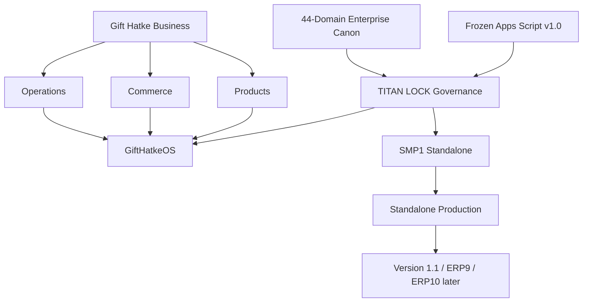

# Gift Hatke — Knowledge Home

## Executive navigation

- [[01_GOVERNANCE/Canon-Recovery-2026-09-12/00-Canon-Reference-Index|Recovered Enterprise Canon — source references]]
- [[01_GOVERNANCE/Canon-Recovery-2026-09-12/Vault-Integration-Verification-2026-09-12|Canon reference integration — verified 12 September 2026]]
- [[Current Operating Snapshot]]
- [[../01_GOVERNANCE/TITAN LOCK - Master Governance]]
- [[../01_GOVERNANCE/Authority Hierarchy]]
- [[../01_GOVERNANCE/Enterprise Canon - 44 Domain Overview]]
- [[../01_GOVERNANCE/Roadmap - Locked Sequence]]
- [[../02_BUSINESS/Business MOC]]
- [[../03_PRODUCTS/Product MOC]]
- [[../04_COMMERCE_MARKETING/Commerce and Marketing MOC]]
- [[../05_OPERATIONS/Operations MOC]]
- [[../07_GIFTHATKEOS/00_MOC/GiftHatkeOS MOC]]
- [[../08_KNOWLEDGE_BASE/Knowledge Base Charter]]
- [[../09_TIMELINE/Gift Hatke Timeline]]
- [[../10_REGISTERS/Decision Register]]
- [[../10_REGISTERS/Branches Commits Tags and Certifications]]
- [[../10_REGISTERS/Open Issues Risks and Unknowns]]

## Knowledge graph

## Working principle
GiftHatkeOS is not merely an Apps Script project. It is a **runtime-independent business platform** covering CRM, customers, orders, production, inventory, finance, shipping, permissions, documentation, workflows, validation/business rules and SOPs. Apps Script is the permanent reference implementation; standalone is the target runtime.

## Latest Canon source recovery

[[Order-Stages-1-2-Recovery-Addendum]] records recovery of the two original Order Canon stages and the remaining parity reconciliation gate.

## Canon reconciliation checkpoint — 13 September 2026

[[Canon-Reconciliation-Checkpoint-2026-09-13]]

[[SMP1-44-Domain-Parity-Working-Matrix]]

Working evidence inventory; final parity and publication remain incomplete.

## Recovery control reconciliation

[[Recovery-Control-Source-Reconciliation]] records the directly inspected Pack 2.11 closure and the remaining production recovery evidence boundary.

## Production recovery and cutover evidence gate

[[Production-Recovery-and-Cutover-Evidence-Blocker]] lists the inspected authorities and exact operational records still required.

## Order Canon source reconciliation

[[Order-Canon-Source-Reconciliation]] records verified frozen vocabulary matches, current composition and unresolved Canon differences.

## Domain 21 product reconciliation

[[Domain-21-Product-Scope-Reconciliation]] records the evidence-only Product scope decision and [[Domain-21-Product-Source-Provenance]] records source provenance.

## Domain 22 marketing reconciliation

[[Domain-22-Marketing-Scope-Reconciliation]] records the evidence-only Marketing scope decision and provenance.

## Domain 23 partner reconciliation

[[Domain-23-Partner-Scope-Reconciliation]] records the evidence-only Partner scope decision and provenance.

## Domain 24 legal reconciliation

[[Domain-24-Legal-Scope-Reconciliation]] records the evidence-only Legal scope decision and provenance.

## Domain 25 workforce reconciliation

[[Domain-25-Workforce-Scope-Reconciliation]] records the evidence-only Workforce scope decision and provenance.

## Domain 26 asset reconciliation

[[Domain-26-Asset-Scope-Reconciliation]] records the evidence-only Asset scope decision and provenance.

## Domain 27 sustainability reconciliation

[[Domain-27-Sustainability-Scope-Reconciliation]] records the evidence-only Sustainability/EHS scope decision and provenance.

## Domain 28 security reconciliation

[[Domain-28-Security-Scope-Reconciliation]] records the evidence-only Security scope decision and provenance.

## Domain 29 data governance reconciliation

[[Domain-29-Data-Governance-Scope-Reconciliation]] records the evidence-only Data Governance scope decision and provenance.

## Domain 30 analytics reconciliation

[[Domain-30-Analytics-Scope-Reconciliation]] records the evidence-only Analytics scope decision and provenance.

## Domain 31 revenue reconciliation

[[Domain-31-Revenue-Scope-Reconciliation]] records the evidence-only Revenue scope decision and provenance.

## Domain 32 customer success reconciliation

[[Domain-32-Customer-Success-Scope-Reconciliation]] records the evidence-only Customer Success scope decision and provenance.

## Domain 33 supply chain reconciliation

[[Domain-33-Supply-Chain-Scope-Reconciliation]] records the evidence-only Supply Chain scope decision and provenance.

## Domain 34 manufacturing excellence reconciliation

[[Domain-34-Manufacturing-Excellence-Scope-Reconciliation]] records the evidence-only Manufacturing Excellence scope decision and provenance.

## Domain 35 innovation reconciliation

[[Domain-35-Innovation-Scope-Reconciliation]] records the evidence-only Innovation scope decision and provenance.

## Domain 36 project reconciliation

[[Domain-36-Project-Scope-Reconciliation]] records the evidence-only Project/Portfolio scope decision and provenance.

## Domain 37 corporate governance reconciliation

[[Domain-37-Corporate-Governance-Scope-Reconciliation]] records the evidence-only Corporate Governance scope decision and provenance.

## Domain 38 resilience reconciliation

[[Domain-38-Resilience-Scope-Reconciliation]] records the evidence-only Resilience scope decision and provenance.

## Domain 39 assurance reconciliation

[[Domain-39-Assurance-Scope-Reconciliation]] records the evidence-only Assurance scope decision and provenance.

## Domain 40 globalization reconciliation

[[Domain-40-Globalization-Scope-Reconciliation]] records the evidence-only Globalization scope decision and provenance.

## Domain 41 platform reconciliation

[[Domain-41-Platform-Scope-Reconciliation]] records the evidence-only Platform scope decision and provenance.

## Domain 42 AI reconciliation

[[Domain-42-AI-Scope-Reconciliation]] records the evidence-only AI scope decision and provenance.

## Domain 43 ecosystem reconciliation

[[Domain-43-Ecosystem-Scope-Reconciliation]] records the evidence-only Ecosystem scope decision and provenance.

## Domain 44 knowledge reconciliation

[[Domain-44-Knowledge-Scope-Reconciliation]] records the evidence-only Knowledge scope decision and provenance.

## Canon recovery final reconciliation — 13 September 2026

[[01_GOVERNANCE/Canon-Reconciliation-2026-09-13/SMP1-Canon-Recovery-Final-Reconciliation-2026-09-13|SMP1 Canon Recovery and Final Reconciliation — final governance record]]

[[01_GOVERNANCE/Canon-Reconciliation-2026-09-13/SMP1-44-Domain-Parity-Final-Matrix-2026-09-13|SMP1 44-domain parity final evidence-bound matrix]]

[[01_GOVERNANCE/Canon-Reconciliation-2026-09-13/SMP1-Finding-Register-Final-Reconciliation-2026-09-13|SMP1 finding register final reconciliation]]

Exact Canon recovery and evidence-bound reconciliation are published. Exhaustive behavioral parity, fresh authenticated acceptance and handover remain blocked by the recorded findings.

## Repository publication status — 13 September 2026

[[01_GOVERNANCE/Canon-Reconciliation-2026-09-13/SMP1-Canon-Recovery-Source-Provenance-2026-09-13|Canon recovery source provenance and artifact checksums]]

[[01_GOVERNANCE/Canon-Reconciliation-2026-09-13/SMP1-Canon-Recovery-Repository-Publication-Blocker-2026-09-13|Repository publication blocker and retry scope]]

The exact evidence set is validated and preserved. The additive repository commit is pending because the GitHub connector automatic review reached its usage limit before blob creation.
