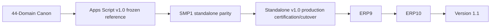

# Roadmap — Locked Sequence

## Completed/established foundation
- Engineering foundation / ERP0
- Business platform ERP1–ERP8
- ERP8 final freeze
- BRC1 business readiness
- RSA1
- GLP1 go-live programme
- Apps Script V1.0 production closure/handover
- V1.0 permanent reference freeze
- SMP1 standalone migration programme

## Current programme logic

## Locked prohibition
Do not implement ERP9/ERP10 on the frozen Apps Script reference and do not use Version 1.1 to evade unfinished standalone parity.

## Long-range direction
Later evolution may include AI, analytics, warehouse/mobile capabilities, multi-branch, franchise and broader enterprise capabilities, but only after the locked sequence above.

## SMP1 wave ledger — 10 Sep 2026

The detailed module ledger below supersedes older retained roadmap notes while
preserving them as history.

### Completed and closed

- Orders — completed in the certified standalone foundation.
- Production — completed in the certified standalone foundation.
- Inventory — completed in the certified standalone foundation.
- Dashboard — **CERTIFIED / LIVE / CLOSED / 100%**.
- CRM — **CERTIFIED / LIVE / CLOSED / 100%**.
- Customers — **CERTIFIED / LIVE / CLOSED / 100%**.
- Personalization — **CERTIFIED / LIVE / CLOSED / 100%**.
- Procurement — **CERTIFIED / LIVE / CLOSED / 100%**.

### Current closure work

- Shipping implementation — **100% of authorized code scope published**.
- Shipping overall — not yet certified/live/closed because authenticated
  production acceptance and final closure evidence remain.

### Remaining core SMP1 sequence

1. Complete Shipping production acceptance and certification/closure.
2. Finance.
3. Reports.
4. User Management.
5. Settings.
6. Final cross-module regression, live acceptance, cutover and handover.

### Separate future commercial wave

7. Retailer / Reseller / Partner Dashboard, governed as a distinct commercial
   capability with its own Titan Lock authorization and closure gates. It must
   not be folded into Personalization, Procurement or Shipping.
