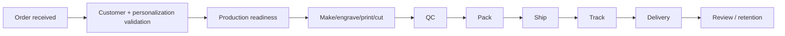

# Order to Delivery Lifecycle

Core Gift Hatke operational flow:

GiftHatkeOS exists to make this lifecycle observable, permissioned and auditable across Orders, Production, Inventory, Shipping, Finance and CRM/Customers.
