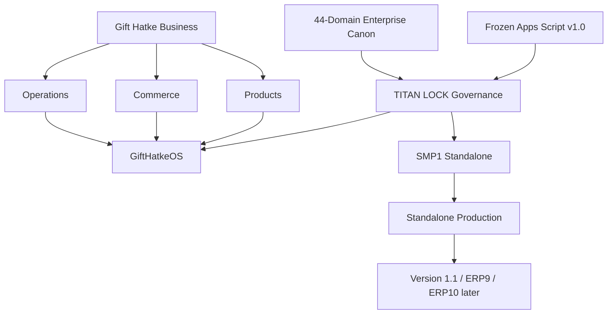

# Gift Hatke — Knowledge Home

## Executive navigation
- [[Current Operating Snapshot]]
- [[../01_GOVERNANCE/TITAN LOCK - Master Governance]]
- [[../01_GOVERNANCE/Authority Hierarchy]]
- [[../01_GOVERNANCE/Enterprise Canon - 44 Domain Overview]]
- [[../01_GOVERNANCE/Roadmap - Locked Sequence]]
- [[../02_BUSINESS/Business MOC]]
- [[../03_PRODUCTS/Product MOC]]
- [[../04_COMMERCE_MARKETING/Commerce and Marketing MOC]]
- [[../05_OPERATIONS/Operations MOC]]
- [[../07_GIFTHATKEOS/00_MOC/GiftHatkeOS MOC]]
- [[../08_KNOWLEDGE_BASE/Knowledge Base Charter]]
- [[../09_TIMELINE/Gift Hatke Timeline]]
- [[../10_REGISTERS/Decision Register]]
- [[../10_REGISTERS/Branches Commits Tags and Certifications]]
- [[../10_REGISTERS/Open Issues Risks and Unknowns]]

## Knowledge graph

## Working principle
GiftHatkeOS is not merely an Apps Script project. It is a **runtime-independent business platform** covering CRM, customers, orders, production, inventory, finance, shipping, permissions, documentation, workflows, validation/business rules and SOPs. Apps Script is the permanent reference implementation; standalone is the target runtime.
